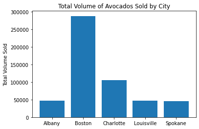
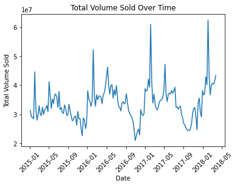
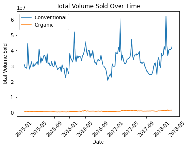
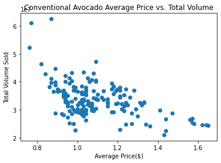
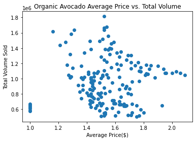
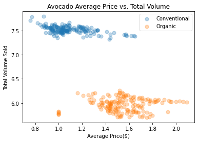

# Task One


```python
%autosave 5
```


    Autosaving every 5 seconds


```python
import pandas as pd
import numpy as np
import matplotlib.pyplot as plt
```


```python
avo_df = pd.read_csv("https://raw.githubusercontent.com/pathstream-curriculum/Python/master/avocado.csv")
```


```python
avo_df.info()
```

    <class 'pandas.core.frame.DataFrame'>
    RangeIndex: 18249 entries, 0 to 18248
    Data columns (total 14 columns):
     #   Column        Non-Null Count  Dtype  
    ---  ------        --------------  -----  
     0   Unnamed: 0    18249 non-null  int64  
     1   Date          18249 non-null  object 
     2   AveragePrice  18249 non-null  float64
     3   Total Volume  18249 non-null  float64
     4   4046          18249 non-null  float64
     5   4225          18249 non-null  float64
     6   4770          18249 non-null  float64
     7   Total Bags    18249 non-null  float64
     8   Small Bags    18249 non-null  float64
     9   Large Bags    18249 non-null  float64
     10  XLarge Bags   18249 non-null  float64
     11  type          18249 non-null  object 
     12  year          18249 non-null  int64  
     13  region        18249 non-null  object 
    dtypes: float64(9), int64(2), object(3)
    memory usage: 1.9+ MB


```python
print(avo_df.head())
print(avo_df.tail())
```

       Unnamed: 0        Date  AveragePrice  Total Volume     4046       4225  \
    0           0  2015-12-27          1.33      64236.62  1036.74   54454.85   
    1           1  2015-12-20          1.35      54876.98   674.28   44638.81   
    2           2  2015-12-13          0.93     118220.22   794.70  109149.67   
    3           3  2015-12-06          1.08      78992.15  1132.00   71976.41   
    4           4  2015-11-29          1.28      51039.60   941.48   43838.39   
    
         4770  Total Bags  Small Bags  Large Bags  XLarge Bags          type  \
    0   48.16     8696.87     8603.62       93.25          0.0  conventional   
    1   58.33     9505.56     9408.07       97.49          0.0  conventional   
    2  130.50     8145.35     8042.21      103.14          0.0  conventional   
    3   72.58     5811.16     5677.40      133.76          0.0  conventional   
    4   75.78     6183.95     5986.26      197.69          0.0  conventional   
    
       year  region  
    0  2015  Albany  
    1  2015  Albany  
    2  2015  Albany  
    3  2015  Albany  
    4  2015  Albany  
           Unnamed: 0        Date  AveragePrice  Total Volume     4046     4225  \
    18244           7  2018-02-04          1.63      17074.83  2046.96  1529.20   
    18245           8  2018-01-28          1.71      13888.04  1191.70  3431.50   
    18246           9  2018-01-21          1.87      13766.76  1191.92  2452.79   
    18247          10  2018-01-14          1.93      16205.22  1527.63  2981.04   
    18248          11  2018-01-07          1.62      17489.58  2894.77  2356.13   
    
             4770  Total Bags  Small Bags  Large Bags  XLarge Bags     type  year  \
    18244    0.00    13498.67    13066.82      431.85          0.0  organic  2018   
    18245    0.00     9264.84     8940.04      324.80          0.0  organic  2018   
    18246  727.94     9394.11     9351.80       42.31          0.0  organic  2018   
    18247  727.01    10969.54    10919.54       50.00          0.0  organic  2018   
    18248  224.53    12014.15    11988.14       26.01          0.0  organic  2018   
    
                     region  
    18244  WestTexNewMexico  
    18245  WestTexNewMexico  
    18246  WestTexNewMexico  
    18247  WestTexNewMexico  
    18248  WestTexNewMexico  


```python
avo_df.describe()
```


<div>
<style scoped>
    .dataframe tbody tr th:only-of-type {
        vertical-align: middle;
    }

    .dataframe tbody tr th {
        vertical-align: top;
    }

    .dataframe thead th {
        text-align: right;
    }
</style>
<table border="1" class="dataframe">
  <thead>
    <tr style="text-align: right;">
      <th></th>
      <th>Unnamed: 0</th>
      <th>AveragePrice</th>
      <th>Total Volume</th>
      <th>4046</th>
      <th>4225</th>
      <th>4770</th>
      <th>Total Bags</th>
      <th>Small Bags</th>
      <th>Large Bags</th>
      <th>XLarge Bags</th>
      <th>year</th>
    </tr>
  </thead>
  <tbody>
    <tr>
      <th>count</th>
      <td>18249.000000</td>
      <td>18249.000000</td>
      <td>1.824900e+04</td>
      <td>1.824900e+04</td>
      <td>1.824900e+04</td>
      <td>1.824900e+04</td>
      <td>1.824900e+04</td>
      <td>1.824900e+04</td>
      <td>1.824900e+04</td>
      <td>18249.000000</td>
      <td>18249.000000</td>
    </tr>
    <tr>
      <th>mean</th>
      <td>24.232232</td>
      <td>1.405978</td>
      <td>8.506440e+05</td>
      <td>2.930084e+05</td>
      <td>2.951546e+05</td>
      <td>2.283974e+04</td>
      <td>2.396392e+05</td>
      <td>1.821947e+05</td>
      <td>5.433809e+04</td>
      <td>3106.426507</td>
      <td>2016.147899</td>
    </tr>
    <tr>
      <th>std</th>
      <td>15.481045</td>
      <td>0.402677</td>
      <td>3.453545e+06</td>
      <td>1.264989e+06</td>
      <td>1.204120e+06</td>
      <td>1.074641e+05</td>
      <td>9.862424e+05</td>
      <td>7.461785e+05</td>
      <td>2.439660e+05</td>
      <td>17692.894652</td>
      <td>0.939938</td>
    </tr>
    <tr>
      <th>min</th>
      <td>0.000000</td>
      <td>0.440000</td>
      <td>8.456000e+01</td>
      <td>0.000000e+00</td>
      <td>0.000000e+00</td>
      <td>0.000000e+00</td>
      <td>0.000000e+00</td>
      <td>0.000000e+00</td>
      <td>0.000000e+00</td>
      <td>0.000000</td>
      <td>2015.000000</td>
    </tr>
    <tr>
      <th>25%</th>
      <td>10.000000</td>
      <td>1.100000</td>
      <td>1.083858e+04</td>
      <td>8.540700e+02</td>
      <td>3.008780e+03</td>
      <td>0.000000e+00</td>
      <td>5.088640e+03</td>
      <td>2.849420e+03</td>
      <td>1.274700e+02</td>
      <td>0.000000</td>
      <td>2015.000000</td>
    </tr>
    <tr>
      <th>50%</th>
      <td>24.000000</td>
      <td>1.370000</td>
      <td>1.073768e+05</td>
      <td>8.645300e+03</td>
      <td>2.906102e+04</td>
      <td>1.849900e+02</td>
      <td>3.974383e+04</td>
      <td>2.636282e+04</td>
      <td>2.647710e+03</td>
      <td>0.000000</td>
      <td>2016.000000</td>
    </tr>
    <tr>
      <th>75%</th>
      <td>38.000000</td>
      <td>1.660000</td>
      <td>4.329623e+05</td>
      <td>1.110202e+05</td>
      <td>1.502069e+05</td>
      <td>6.243420e+03</td>
      <td>1.107834e+05</td>
      <td>8.333767e+04</td>
      <td>2.202925e+04</td>
      <td>132.500000</td>
      <td>2017.000000</td>
    </tr>
    <tr>
      <th>max</th>
      <td>52.000000</td>
      <td>3.250000</td>
      <td>6.250565e+07</td>
      <td>2.274362e+07</td>
      <td>2.047057e+07</td>
      <td>2.546439e+06</td>
      <td>1.937313e+07</td>
      <td>1.338459e+07</td>
      <td>5.719097e+06</td>
      <td>551693.650000</td>
      <td>2018.000000</td>
    </tr>
  </tbody>
</table>
</div>


```python
# avo_df.columns = avo_df.columns.str.replace(" ", "_").str.lower() # this messed up some unit tests
```


```python
avo_df.Date = pd.to_datetime(avo_df.Date)
avo_df.Date
```


    0       2015-12-27
    1       2015-12-20
    2       2015-12-13
    3       2015-12-06
    4       2015-11-29
               ...    
    18244   2018-02-04
    18245   2018-01-28
    18246   2018-01-21
    18247   2018-01-14
    18248   2018-01-07
    Name: Date, Length: 18249, dtype: datetime64[ns]


```python
avo_df_1 = avo_df[avo_df['region'].isin(["Albany", "Boston", "Charlotte", "Louisville", "Spokane"])]
```


```python
avo_df_1_agg = avo_df_1.groupby("region").agg({"Total Volume": "mean"})
```


```python
plt.bar(avo_df_1_agg.index, avo_df_1_agg['Total Volume'])
plt.title("Total Volume of Avocados Sold by City")
plt.ylabel("Total Volume Sold")
```


    Text(0, 0.5, 'Total Volume Sold')


    

    


# Task Three


```python
avo_df_2 = avo_df[avo_df['region'] == 'TotalUS']
```


```python
avo_df_2 = avo_df_2.sort_values(by= ['Date'], axis=0)
```


```python
avo_df_2_conv = avo_df_2[avo_df_2['type'] == 'conventional']
```


```python
# Create a line plot of Total Volume Sold Over Time
plt.plot(avo_df_2_conv["Date"], avo_df_2_conv['Total Volume'])
plt.xticks(rotation=45)
plt.title("Total Volume Sold Over Time")
plt.ylabel("Total Volume Sold")
plt.xlabel("Date")
```


    Text(0.5, 0, 'Date')


    

    


# Task Four


```python
avo_df_2_org = avo_df_2[avo_df_2['type'] == 'organic']
```


```python
# Lineplot that shows both organic and conventional sales over time
plt.plot(avo_df_2_conv["Date"], avo_df_2_conv['Total Volume'])
plt.plot(avo_df_2_org["Date"], avo_df_2_org['Total Volume'])
plt.xticks(rotation=45)
plt.title("Total Volume Sold Over Time")
plt.ylabel("Total Volume Sold")
plt.xlabel("Date")
plt.legend(["Conventional", "Organic"])
```


    <matplotlib.legend.Legend at 0x11daf50d0>


    

    


# Task Five


```python
plt.scatter(avo_df_2_conv['AveragePrice'], avo_df_2_conv['Total Volume'])
plt.title("Conventional Avocado Average Price vs. Total Volume")
plt.xlabel("Average Price($)")
plt.ylabel("Total Volume Sold")
```


    Text(0, 0.5, 'Total Volume Sold')


    

    


```python
plt.scatter(avo_df_2_org['AveragePrice'], avo_df_2_org['Total Volume'])
plt.title("Organic Avocado Average Price vs. Total Volume")
plt.xlabel("Average Price($)")
plt.ylabel("Total Volume Sold")
```


    Text(0, 0.5, 'Total Volume Sold')


    

    


# Task Six


```python
plt.scatter(avo_df_2_conv['AveragePrice'], np.log10(avo_df_2_conv['Total Volume']), s=50, alpha=0.3)
plt.scatter(avo_df_2_org['AveragePrice'], np.log10(avo_df_2_org['Total Volume']), s=50, alpha=0.3)
plt.title("Avocado Average Price vs. Total Volume")
plt.xlabel("Average Price($)")
plt.ylabel("Total Volume Sold")
plt.legend(["Conventional", "Organic"])
```


    <matplotlib.legend.Legend at 0x11dd0c5b0>


    

    


```python

```
